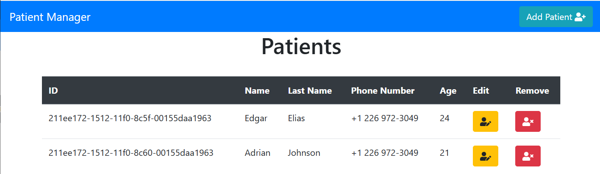

# CRUD Patients

Web application written in Golang that allows users to Create, Read, Update, and Delete Patients. 

## Installation

Install the Gin Gonic (web framework)

```bash
$ go get -u github.com/gin-gonic/gin
```

## Usage
Run the server

```
$ go run main.go
```

Open your browser on `http://localhost:3000/` to interact with the web app.

## Example

